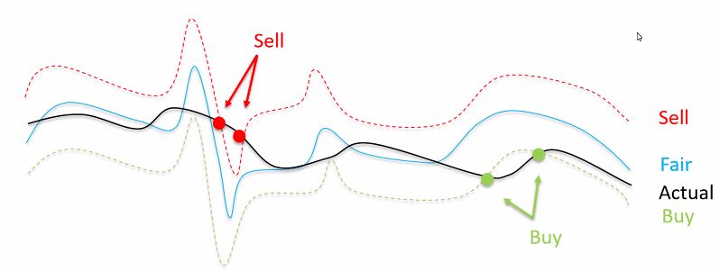
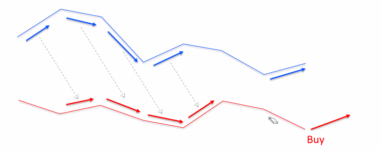
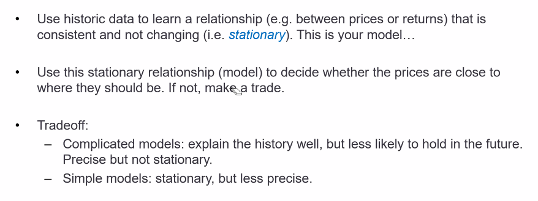
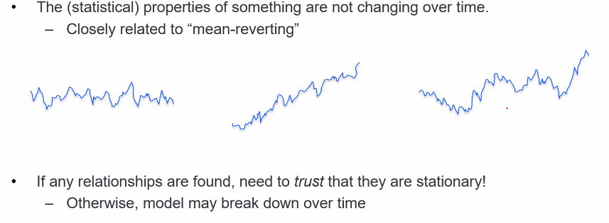
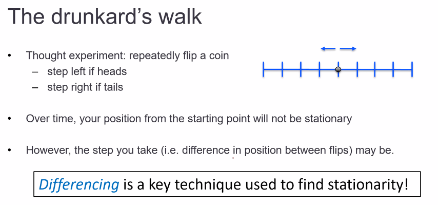
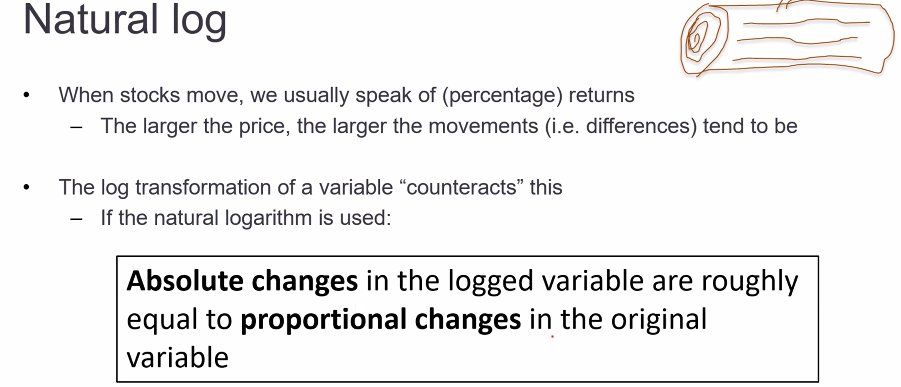
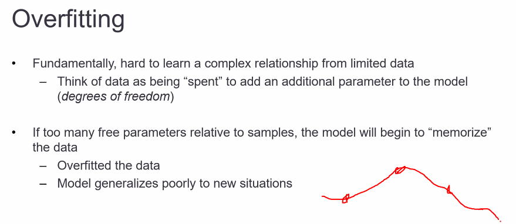

# [SIG x UNSW FinTech Algothon] Workshop 2

## Performance and Risk metrics
* P&L
* WinRate = #WinDays/#AllDays
* Volume, DollarVolume (Turnover)
* Return = P&L/DollarVolume
* SharpeRatio = P&L/StdDev(P&L)
* ...

## Ideas
### Fair Price
* 
* How to calculate "Fair" price?
  * some linear combination of prices of other stocks (eg. average)
  * linear combination of other indicators
  * regression (based on history)
  * fair is non-linear function of prices and whatever other indicators (linear, poly, log, etc. or neural net)

### Pairs
* how to identify good "pairs" of stocks?
  * price difference, price ratio, correlation, imagination, etc.?
* when the discrepancy is large enough to trade?
  * threshold
* 

### Lead-Lag
* 
* red stock goes in the same direction of blue stock
  * blue stock is leading red stock
  * so if blue goes up, buy red (because we expect it to follow the lead)
* How to identify leaders and laggards?
  * amount of time delay to consider?
  * effect of noise?
* more general idea: stock(s) can help forecast another stock(s)

## Modelling from historic data
* 
* Stationarity
  * 
    * first and second examples are stationary
    * third one may or may not be stationary
* 
* Natural Log
  * 
  * log prices and then differences - might find stationarity

## Overfitting
* 
  * k-fold cross validation

## Q&A
* standard libraries like `scikit-learn`, `numpy`, `pandas` is okay
* more info about the competition will be on Monday
  * daily updates
  * horizon: over a year
* 100 instruments
  * price: 250?
* allowed to have long and short positions